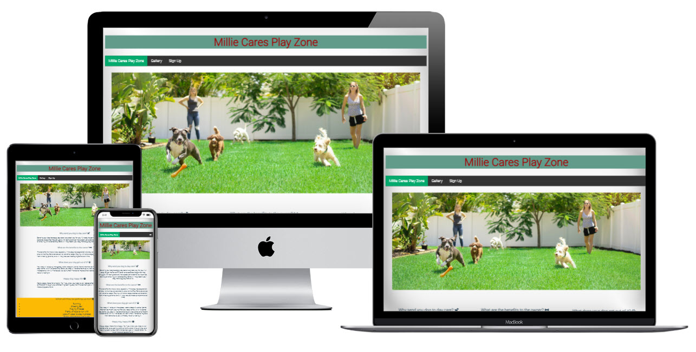

# Millie Cares Play Zone

This is Mille Cares Playzone. My dog Millie has spent many years being looked after by a family between Monday-Friday whilst we work. She has always enjoyed being around other people, including children, as well as other dogs. When she comes back in the evening, you can tell she is happy, well looked after and always tired after a long day of play and stimulation.

This is where the idea for Mille Cares Playzone comes from. A business that caters for dogs, providing them with fun activities and interactions with other dogs away from their famililies for small periods of time. People can leave their dogs at Millie Cares PlayZone whilst they go to work, and not have to worry about if their dog is lonely, or needs to go out or go to the toilet if left alone. Other bonuses with using a doggy day care service is it promotes better behaviour in dogs, as they are constanlty mixing with other dogs and people, and gain improved social and behavioural skills.

People can use the webpage Millie Cares Playzone to find important information such as location, opening times and access to social media profiles of what happens at the Playzone. Users will also be able to navigate away from the Home page, to a gallery of fun pictures, and then a sign up page to leave their details for further enquiries, or joing the newsletter list. 

The project was created using HTML and CSS and JavaScript. 

---
## Features

* **Title**
The Millie Cares Playzone title is styled using Roboto font in a red and is position to the center with a light green background color. The title (header) is positioned and styled the same way across all 3 pages.
The footer is styled with the same green background color and red font color as the header. There is no font using on the header, this has been styled to use social network link images. This footer is also used across all pages for maintain consistency and familiarty for the user. 

* **Navigation**
The navigation menu is located at the top of the page underneath the header to the left of the screen. This is the only part of the design that I have used JavaScript for. The navigation menu has 3 pages to navigate to:
* 'Home' which is where the important information is located, that a user will want to see first as a priority.
* 'Gallery' which shows multiple high quality images of dogs undergoing various different activities.
* 'Sign Up' this allows users to add submit their details to make further enquiries or sig up to the newsletter. 
The navigation menu is styled, so that on smaller screens (such as mobile phones) the menu options disappear into a menu bar that can be pressed and a drop down of the navigational links can be made available. 

* **Footer**
The footer contains social media links styled with images of the major social media companies, and styled in the same manor as the header.
If a user clicks on one of the social media icons a new webpage will open and be linked to the homepage of the corresponding social media platform. 

* **Color Scheme**

---
* **Header**
The header contains a simple title, and also consists of the navigation menu and an image of dogs playing and their carers in the background. 

* **Information (mid-page) Section**
The activities section contains important information as to the benefits of using a Doggy Day Care centre, and also contains priority information regarding a summary of activities dogs will get up to, times the centre will be open and the location of the centre. 

---
* **Gallery Page**
The Gallery Page when navigated to shows images of dogs playing and having fun. Living their best life. Millie, who this page is named after, also makes an appearance in the gallery page. 

* **Sign Up Page**
The Sign Up page is where users can navigate to to leave their details to make further enquires or sign up to the newsletter. The code is written so that users must leave the correct details in order to correctly submit their details. This page was kept very simple so that all focus would be on the sign up document. 

---
* **Testing**
* This webpage has been tested, and works on different explorers such as Chrome, and FireFox.
* This project is responsive and has been designed to work on larger screens as well as small screens, using dev tools it has been tested on iphone screens, ipad screens, as well as other tablets. 
* All text is written and easy to understand
* All images have been selected for the highest possible defintion with bold colors that pop off the screen. 
* The form works, and requires correct information, complete in order for the user to submit their information. 

### Testing of Home page

### Testing of Gallery page

### Testing of Sign Up page

## Validator testing

*html
All code and pages have been checked through the W3C Markup Validation Service. The only error that came back was for a section element in the gallery page, the checker expected to see a heading refernce. But as this was to include an id tag, and not a heading, I am happy that this is a mistake on the vaildation service. 

*css
All css code has been run through the W3C CSS Validation Service and has been passed with no errors found. 

* **Bugs**
All bugs for the webpage have been fixed. 

* **Bug Fixes**
* on the home page there was an issue with loading an interactive google map using iframe, after invesigation I found out that this required JavaScript, and I didn't know how to perform this, so this was removed and an image placed instead.
* in the gallery page there were issues with the images plqacing together, after using dev tools I found the issue and made the correct fix. 
* on the sign up page there was an issue with the form once submitted going to a "cannot load" page, after reading through the code, there was a charatcer mistake. Once changed it worked fine. 
* the navigation menu when on smaller screens wouldn't allow the menu top be opened to show the menu options. After reading throught the process, I found the issue to the javaScript was in the wrong code, once moved it worked fine. 

---
## Launch and Deployment
* In the GitHub repository, navigate to the Settings tab.  
* Scroll down to the GitHub Pages section and click the 'Check it out here!' link.  

* The project has been created using gitpod and deployed using GitHub, the link for the live page is (https://ddrobrien.github.io/Millie-Cares/)

---

## Future Features

* This page can have video added of dogs playing together
* A layout of the center as well as a virtual tour
* An FAQ sheet
---

## Credits

### Content
* The layout of the webpage came from inspiration of the CI [Love Running Project](https://ddrobrien.github.io/Love-Running/)
* Inspiration for both the gallery and sign up came from the CI [Love Running Project](https://ddrobrien.github.io/Love-Running/)
* The code for the navigation menu came from [W3 Schools](https://www.w3schools.com/howto/howto_js_bottom_nav_responsive.asp)
* The font came from [google font](https://fonts.google.com/)
* Images inspiration came from [unsplash.com](https://unsplash.com/s/photos/dogs-playing)
* Color palette inspiration came from [coolers.co](https://coolors.co/)
* html validation came from [W3C Markup Validation Service](https://validator.w3.org/#validate_by_input)
* css validation came from [W3C CSS Validation Service](https://jigsaw.w3.org/css-validator/)
icons inspiration came from [Love Runnning Project] but sourced from [Font Awesome](https://fontawesome.com/)
* Paragraph text was written by myself